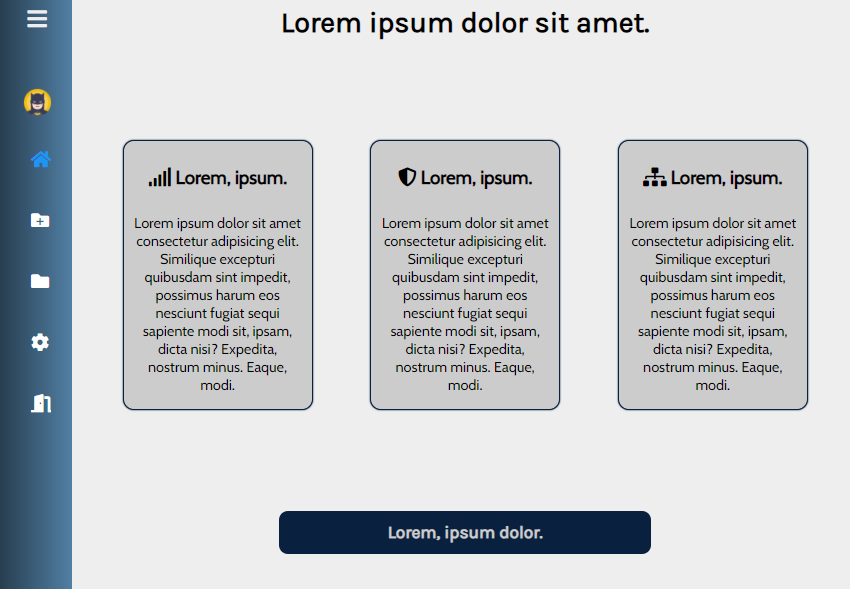
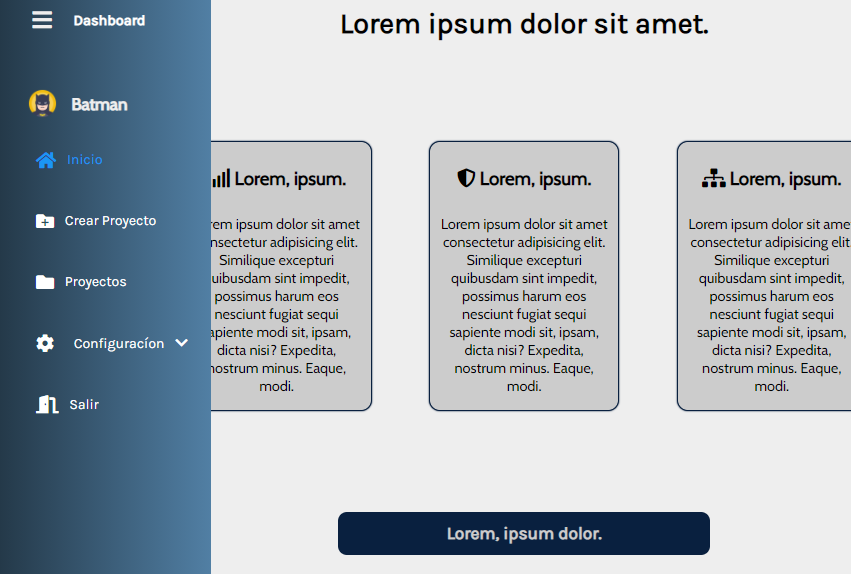
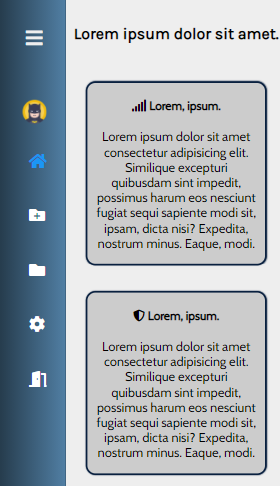
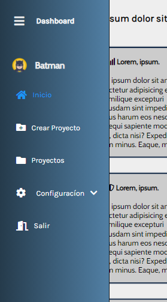

# Dashboard Template

Template de un **dashboard** listo para represantar datos almacenados en una API
o en una base de datos.

El template cuenta con las siguientes secciones:
- Inicio
- Crear Proyecto
- Proyectos
- Configuracion
- Salir